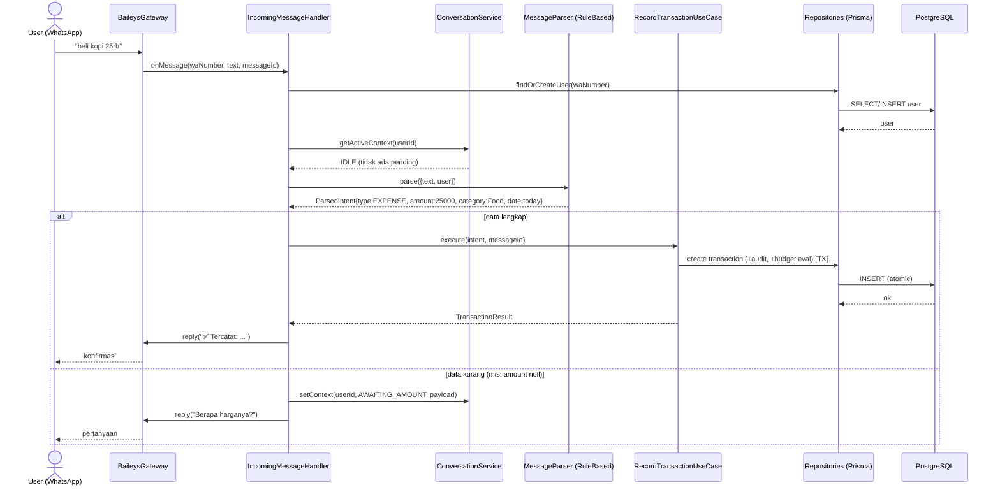
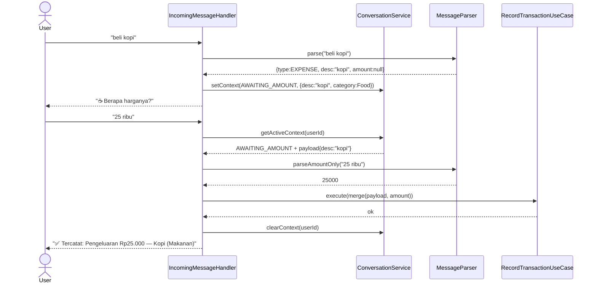
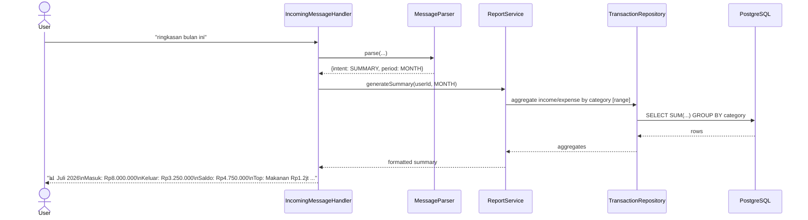
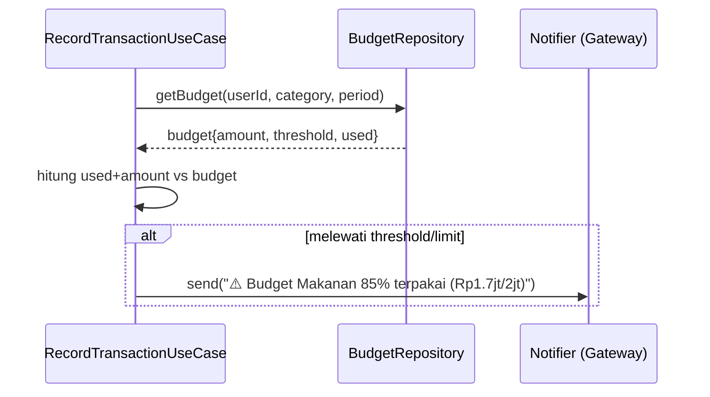
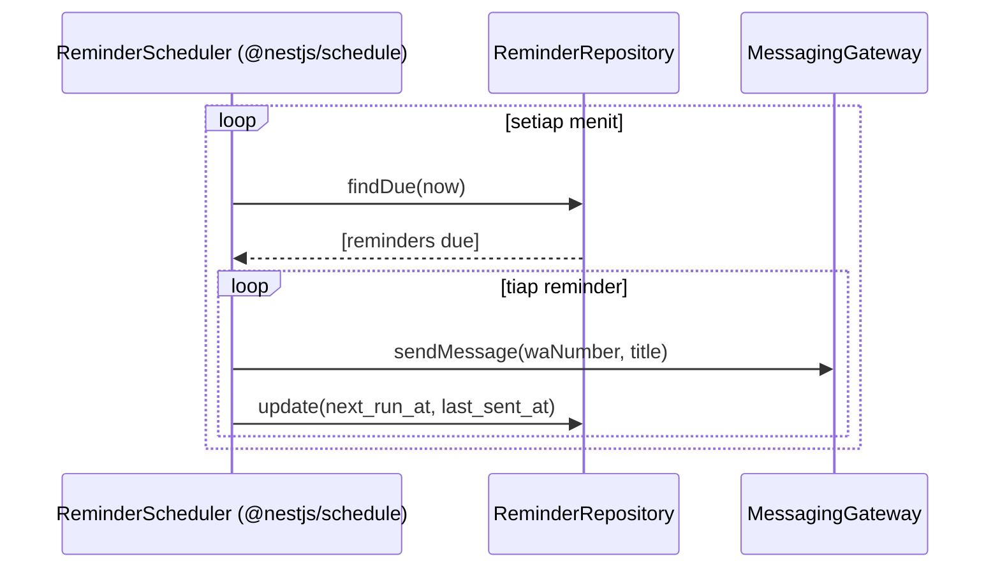
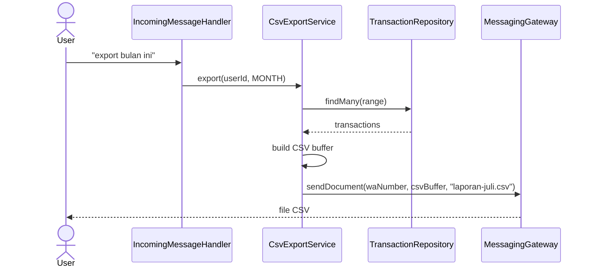
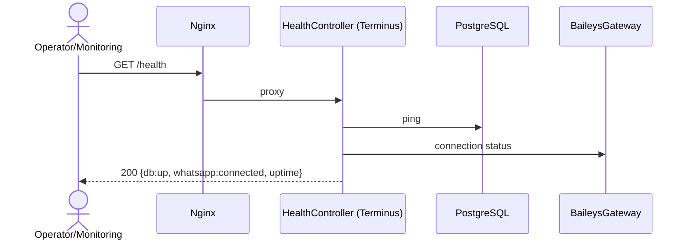

# 04 — Sequence Diagrams

Project: **finance-whatsapp-bot**
Phase: 1 — Project Planning

---

## 1. Alur Utama: Pesan Masuk → Catat Transaksi

---

## 2. Alur Klarifikasi (Conversation Context)

> Catatan: konteks punya `expires_at` (TTL). Jika user justru mengirim perintah lain (mis. "ringkasan bulan ini"), handler mendeteksi intent baru berprioritas dan meng-clear konteks pending.

---

## 3. Alur Ringkasan (Summary)

---

## 4. Alur Budget Alert

---

## 5. Alur Reminder (Scheduler)

---

## 6. Alur Export CSV

---

## 7. Alur Health Check

